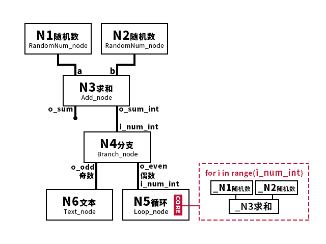
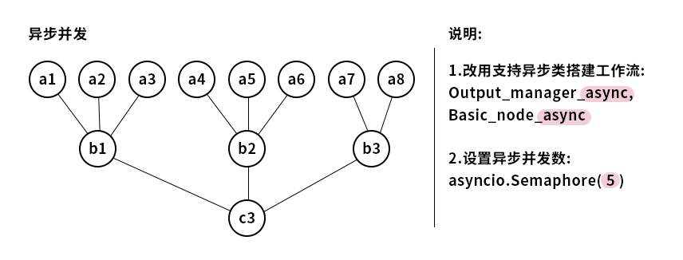
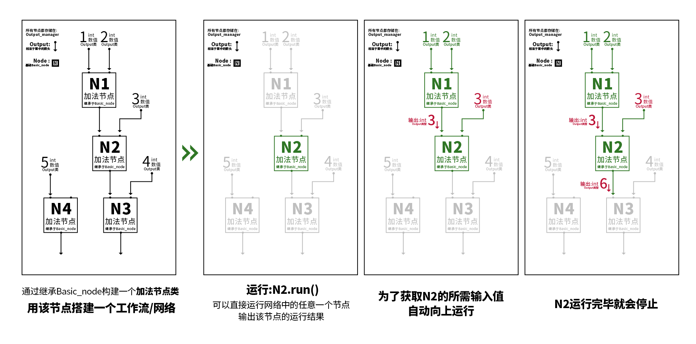
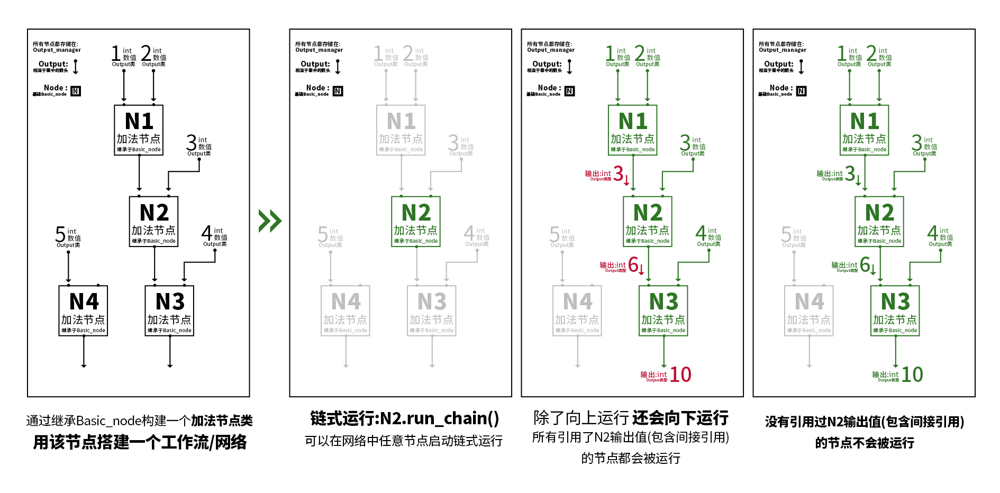
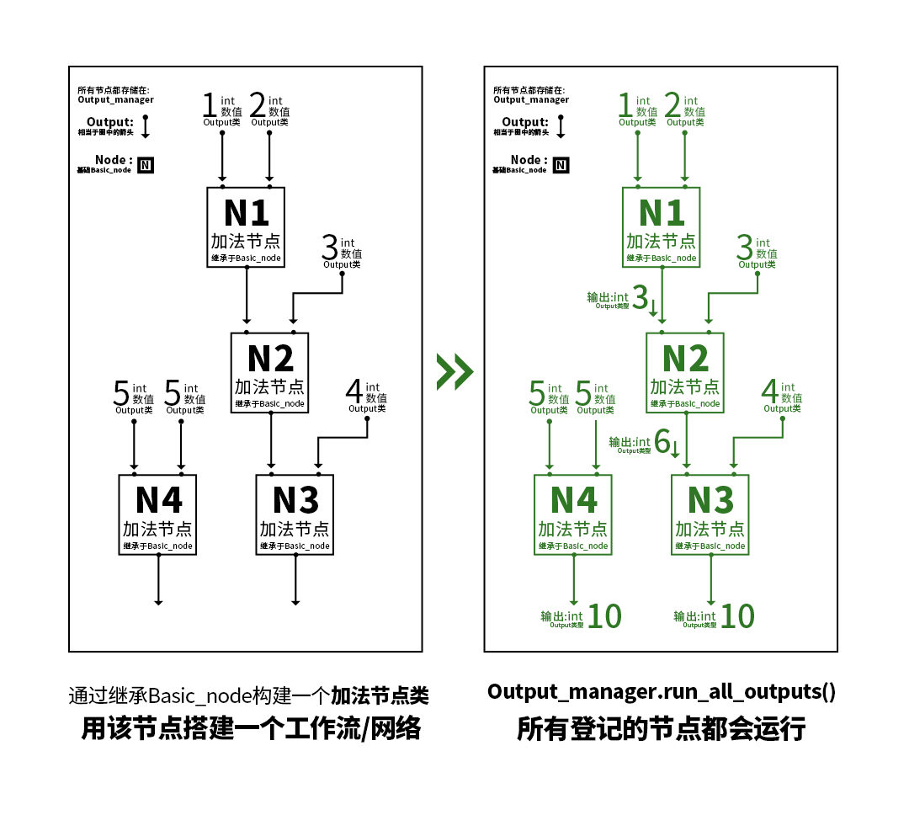
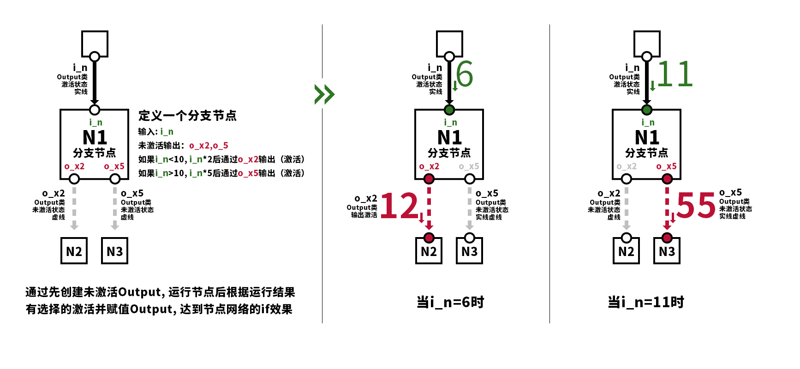
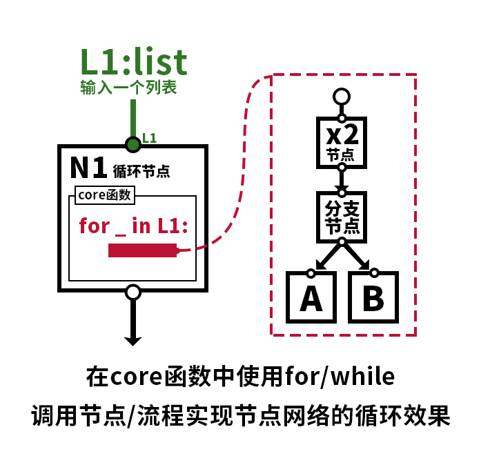
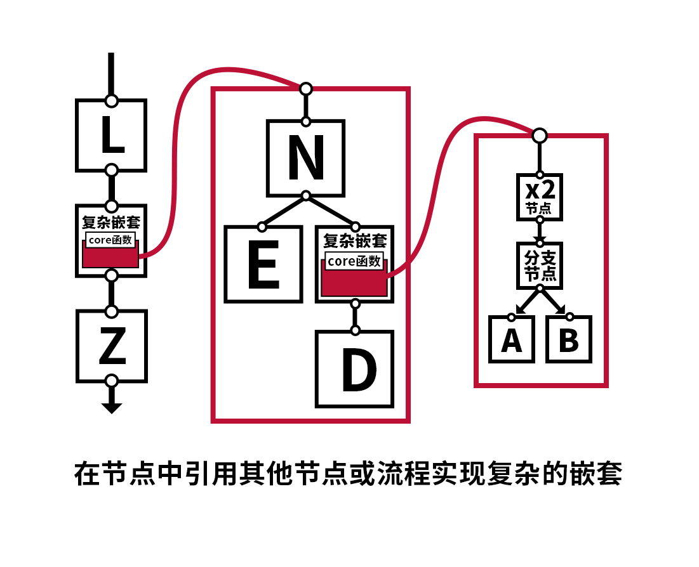

  

<span>

  
</span>


FLOA是一个Python框架 , 用于快速搭建AI工作流 / A Python framework for quick building AI workflow.


---

### 安装

```shell
pip install floa
```

### 使用
例子：通过继承Basic_node实现节点功能，搭建一个如图所示的工作流  

  

```python
from floa import Output_manager, Basic_node
import random


class RandomNum_node(Basic_node):
    "0~10随机数字节点"

    def input(self):
        pass

    def output(self):
        self.o_num = self.create_output_required()

    def core(self):
        self.o_num.complete(random.random()*10)
        print("随机数节点输出:", self.o_num.value)
        return True

class Add_node(Basic_node):
    "加法节点"

    def input(self, a, b):
        self.i_a = self.create_input_verify(a)
        self.i_b = self.create_input_verify(b)

    def output(self):
        self.o_sum = self.create_output_required()
        self.o_sum_int = self.create_output_required()

    def core(self):
        o_sum = self.i_a.value + self.i_b.value
        o_sum_int = int(o_sum)
        self.o_sum.complete(o_sum)
        self.o_sum_int.complete(o_sum_int)
        print(f"加法节点输出,o_sum:{self.o_sum},o_sum_int:{self.o_sum_int}")
        return True

class Branch_node(Basic_node):
    "分支节点"

    def input(self, num_int):
        self.i_num_int = self.create_input_verify(num_int)

    def output(self):
        self.o_odd = self.create_output_optional()  # 奇数
        self.o_even = self.create_output_optional()  # 偶数

    def core(self):
        num = int(self.i_num_int.value)
        if num % 2 == 0:
            self.o_even.activate_and_complete(num,self)
        else:
            self.o_odd.activate_and_complete(num,self)
        print(f"奇偶分支节点输出,o_odd:{self.o_odd},o_even:{self.o_even}")
        return True

class Loop_node(Basic_node):
    "循环节点"

    def input(self, num_int):
        self.i_num_int = self.create_input_verify(num_int)

    def output(self):
        self.o_random_sum = self.create_output_required()

    def core(self):
        _om = Output_manager()
        o_random_sum = 0
        print("循环----")
        for i in range(self.i_num_int.value):
            _n1 = RandomNum_node(_om)
            _n2 = RandomNum_node(_om)
            _n3 = Add_node(_om)
            _n3.input(_n1.o_num, _n2.o_num)
            _n3.run()
            o_random_sum += _n1.o_num.value
        print("循环----")
        self.o_random_sum.complete(o_random_sum)
        return True

class Text_node(Basic_node):
    "文本节点"

    def input(self, t):
        self.i_t = self.create_input_verify(t)
    def output(self):
        pass
    def core(self):
        print(f"奇数,没有进入循环,{self.i_t.value}")
        return True

om = Output_manager()

n1 = RandomNum_node(om)
n2 = RandomNum_node(om)
n3 = Add_node(om)
n4 = Branch_node(om)
n5 = Loop_node(om)
n6 = Text_node(om)

n3.input(n1.o_num, n2.o_num)
n4.input(n3.o_sum_int)
n5.input(n4.o_even)
n6.input(n4.o_odd)

n1.run_chain()

```
返回（偶数情况）：
```
随机数节点输出: 0.7183263256552752
随机数节点输出: 9.778909838547282
加法节点输出,o_sum:10.497236164202556,o_sum_int:10
奇偶分支节点输出,o_odd:None,o_even:10
循环----
随点输出: 9.575348349989815
随机数节点输出: 9.65215113676025
加法节点输出,o_sum:19.227499486750062,o_sum_int:19
<...省略...>
随机数节点输出: 1.8791804643619792
随机数节点输出: 0.14144630166600836
加法节点输出,o_sum:3.2115728227046025,o_sum_int:3
循环----
```
返回（奇数情况）：
```
随机数节点输出: 8.260669282639027
随机数节点输出: 6.796344337173669
加法节点输出,o_sum:15.057013619812697,o_sum_int:15
奇偶分支节点输出,o_odd:15,o_even:None
奇数,没有进入循环,15
```


例子：通过继承Basic_node_async搭建一个支持异步并发的工作流



```python
import asyncio
from floa import Output_manager_async, Basic_node_async
import random

class async_node(Basic_node_async):
    def __init__(self,om,semaphore,name):
        super().__init__(om,semaphore)
        self.name = name
    def input(self, *args):
        for arg in args:
            self.create_input_verify(arg)
    def output(self):
        self.o_output = self.create_output_required()
    async def core(self):
        t = random.randint(1, 2)
        print(f"运行: {self.name},休眠:{t},剩余可运行线程数:{self.semaphore._value}")
        await asyncio.sleep(t)
        print(f"结束: {self.name},耗时:{t},剩余可运行线程数:{self.semaphore._value}")
        self.o_output.complete(t)
        return True

async def main():
    semaphore = asyncio.Semaphore(5)
    om_async = Output_manager_async(semaphore)
    a1 = async_node(om_async, semaphore, "A1")
    a2 = async_node(om_async, semaphore, "A2")
    a3 = async_node(om_async, semaphore, "A3")
    a4 = async_node(om_async, semaphore, "A4")
    a5 = async_node(om_async, semaphore, "A5")
    a6 = async_node(om_async, semaphore, "A6")
    a7 = async_node(om_async, semaphore, "A7")
    a8 = async_node(om_async, semaphore, "A8")
    b1 = async_node(om_async, semaphore, "B1")
    b2 = async_node(om_async, semaphore, "B2")
    b3 = async_node(om_async, semaphore, "B3")
    c1 = async_node(om_async, semaphore, "C1")
    b1.input(a1.o_output,a2.o_output,a3.o_output,)
    b2.input(a4.o_output, a5.o_output,a6.o_output)
    b3.input(a7.o_output, a8.o_output)
    c1.input(b1.o_output,b2.o_output,b3.o_output)
    await c1.run()

asyncio.run(main())
```
输出:
```
运行: A1,休眠:1,剩余可运行线程数:5
运行: A2,休眠:1,剩余可运行线程数:4
运行: A3,休眠:2,剩余可运行线程数:3
运行: A4,休眠:1,剩余可运行线程数:2
运行: A5,休眠:1,剩余可运行线程数:1
运行: A6,休眠:2,剩余可运行线程数:0
结束: A1,耗时:1,剩余可运行线程数:0
结束: A2,耗时:1,剩余可运行线程数:0
结束: A5,耗时:1,剩余可运行线程数:0
结束: A4,耗时:1,剩余可运行线程数:1
运行: A7,休眠:1,剩余可运行线程数:2
运行: A8,休眠:1,剩余可运行线程数:2
结束: A6,耗时:2,剩余可运行线程数:2
结束: A7,耗时:1,剩余可运行线程数:3
结束: A3,耗时:2,剩余可运行线程数:4
结束: A8,耗时:1,剩余可运行线程数:5
运行: B2,休眠:2,剩余可运行线程数:5
运行: B1,休眠:1,剩余可运行线程数:4
运行: B3,休眠:1,剩余可运行线程数:3
结束: B1,耗时:1,剩余可运行线程数:3
结束: B3,耗时:1,剩余可运行线程数:4
结束: B2,耗时:2,剩余可运行线程数:5
运行: C1,休眠:2,剩余可运行线程数:5
结束: C1,耗时:2,剩余可运行线程数:5
```

---
#### 运行节点的三种方法:  

**node.run()** : 运行本节点，node为节点实例。


**node.run()** : 链式运行。


**om.run_all_outputs()** ：运行所有节点，om为Output_manager实例。


#### 通过输出的激活与否来达到节点分支的功能


#### 可以在节点core函中实现节点的循环


#### 可以在节点core函中实现复杂的节点嵌套


---

### 项目结构
```
floa/               
├── output.py    # 输出值对象
└── node.py      # 基础节点
```
---

### Output (class)
**Output** 对象核心是管理一个 "值" -> Output.value，以及与这个值的上下游节点的关系

```python
from floa import Output
o = Output()
print("创建时 o.value 默认值为:",o.value)
o.complete(10) #赋值
print("上游节点有运行结果后对o使用o.complete(10)进行赋值o.value:",o.value,)
```
输出
```
创建时 o.value 默认值为: None
上游节点有运行结果后对o使用o.complete(10)进行赋值o.value: 10
```

Output 包含以下属性和方法：

#### 属性
- **parent**: 父节点，表示该输出的来源节点。

- **active**: 表示该输出(本对象)是否处于活动状态，如果这个值为False那么所有连接了这个输出的下游节点都会失效。

- **done**: 表示该输出(本对象)是否已完成，上游节点完成了计算。

- **value**: 输出的值，Output核心，整个对象就是为了管理这个值，这个值可以是任何类型的数据。

- **child**: 子节点列表，表示所有引用了这个输出值(Output.value)的下游节点。

#### 方法
- **\_\_init__(self, parent=None, value=None, active=True, done=False)**: 初始化输出对象。

- **\_\_call__(self)**: 返回输出值(Output.value)。

- **\_\_str__(self)**: 返回输出值(Output.value)的字符串表示。

- **\_\_repr__(self)**: 返回输出值(Output.value)的字符串表示。

- **complete(self, value)**: 标记本Output对象完成并设置值。

- **activate(self)**: 激活输出对象(Output.active)。

- **activate_and_complete(self, value, parent)**: 激活输出对象可用并设置完成，同时设置父节点。

- **deactivate(self)**: 把输出对象标记为不可用。

- **is_deactivated(self)**: 输出对象是否为不可用。

- **val**: 属性，返回输出值(Output.done)。
----

### Output_manager(class)
**Output_manager** 类用于管理输出(**Output**)对象。所有的 **Output** 对象都应该由 **Output_mansager** 创建。 
它将会管理一个工作流的Output

```python
from floa import Output_manager

om = Output_manager()

o = om.create_output_complete(10)
print("[常量] om.create_output_complete创建了一个上游节点已完成运算的输出,可以把它看成一个常量:",o.value,"\n")

o = om.create_output_required(object)
print("[必定输出] om.create_output_required创建并绑定上游节点",o.value)
o.complete(10)
print("上游节点运算完成后, 一定会对o进行赋值,使用:o.complete(10):",o.value,"\n")

o = om.create_output_optional()
print("[可选输出] 使用om.create_output_optional创建一个不激活的输出,节点运算完后有可能输出分支时候使用:",o.value)
o.activate_and_complete(10,object)
print("使用activate_and_complete进行赋值激活:",o.value)
```
输出
```
[常量] om.create_output_complete创建了一个上游节点已完成运算的输出,可以把它看成一个常量: 10 

[必定输出] om.create_output_required创建并绑定上游节点 None
上游节点运算完成后, 一定会对o进行赋值,使用:o.complete(10): 10

[可选输出] 使用om.create_output_optional创建一个不激活的输出,节点运算完后有可能输出分支时候使用: None
使用activate_and_complete进行赋值激活: 10
```

Output_manager 包含以下属性和方法：

#### 属性
**output_list**: 用于存储**Output**对象列表。

__init__(self): 初始化输出管理器。

- **create_output_required(self, parent, value=None, active=True, done=False) -> Output**: 创建一个必定有输出值的Output对象。节点计算完成后必定会对这个对象进行赋值(Output.value)，

- **create_output_optional(self, parent=None, value=None, active=False, done=False) -> Output**: 创建一个未激活的Output对象。节点运行完毕后决定不要不要激活这个Output，一般作为控制节点分支使用

- **create_output_complete(self, value, parent=None, active=True, done=True) -> Output**: 创建一个已完成的Output对象。一般作为常量使用

- **run_all_outputs(self)**: 运行所有记录在output_list的Output上游节点/运行所有节点

----


### Basic_node (class)
**Basic_node** 是所有节点的基类。编写节点规则：1.Basic_node，2.定义input/output函数，3.在 core 函数中编写节点的功能实现（需要返回True/False）。

```python
from floa import Basic_node, Output_manager

#Basic_node 是所有节点的基类。你可以通过继承它来定义输入输出（input/output），然后在 core 里写代码，实现具体的节点功能。
class x2node(Basic_node):
    def input(self, n):
        self.n = self.create_input_verify(n)
        return self
    def output(self):
        self.output_nx2 = self.create_output_required()
    def core(self) -> bool:
        nx2 = self.n.value * 2
        self.output_nx2.complete(nx2)
        return True

om = Output_manager()
n1 = x2node(om)
n2 = x2node(om).input(n1.output_nx2)
n3 = x2node(om).input(n2.output_nx2)

n1.input(3)
n1.run_chain()
print(f"n1输出:{n1.output_nx2},n2输出:{n2.output_nx2},n3输出:{n3.output_nx2}")
```
输出
```
n1输出:6,n2输出:12,n3输出:24
```

#### 属性

- **om**: Output_manager的实例，用来新建和管理Output对象。

- **done**: 表示本节点是否已完成计算，节点默认只会计算一次。

- **active**: 表示节点是否处于激活状态。

- **list_output**: 节点输出对象列表。

- **list_input_verify**: 输入对象，运行前会验证该对象是否已执行，若未执行则会运行上游节点以获取输入对象的值。

- **list_input_optional**: 输入对象，运行节点前不会验证输入对象的上游节点是否已经执行了。

- **dict_output**: 输出字典。值与list_output一致，多了输出对象的键值名称

- **dict_input**: 输入字典。值与list_input_verify和list_input_optional一致，多了输入对象的键值名称

- **retry_count**: 记录重试次数。

- **max_retries**: 最大重试次数，如果core返回False，会重新调用core直到达到最大重试次数。

#### 方法

- **\_\_init__(self, om: Output_manager, *args, \*\*kwargs)**: 初始化节点对象。

- **\_\_call__(self)**: 运行节点。

- **verify(self, *args: list[Output])**: 验证输入数据，如果上游节点没有运行会向上运行，直至所需的输入对象全部完成。

- **create_input_verify(self, value: Output)**: 创建一个输入对象，运行节点前会验证这个输入对象是已完成的，若该输入对象未完成，会运行该对象的上游节点。

- **create_input_optional(self, value: Output)**: 创建一个输入对象，节点运行时候，这个输入对象是可选的，即使这个输入对象未完成，也不会运行这个输入对象的上游节点。

- **create_output_required(self)**: 创建一个输出对象，节点运行完成后一定会对这个对象进行赋值并标记完成。

- **create_output_optional(self)**: 创建一个默认状态为未激活状态的输出对象，节点运行完成后根据具体情况来决定是否激活完成这个输出对象，通常用于节点分支，或可选输出。

- **run_chain(self)**: 链式运行，运行自身节点后会向下运行所有引用本节点输出(包含间接引用)的节点。

- **run(self)**: 运行本节点。

- **core(self)**: 节点功能的具体实现，继承本对象后要重写这个方法。

- **input(self)**: 定义输入有哪些(Output对象)，继承本对象后要重写这个方法。

- **output(self)**: 定义输出有哪些(Output对象)，继承本对象后要重写这个方法。

- **set_deactivate(self)**: 设置节点为失效状态。

- **set_complete(self)**: 设置节点为完成状态。

- **set_max_retries(self, max_retries: int)**: 设置运行节点(core)失败重试次数。

- **print(self, *args)**: 打印节点信息。

----